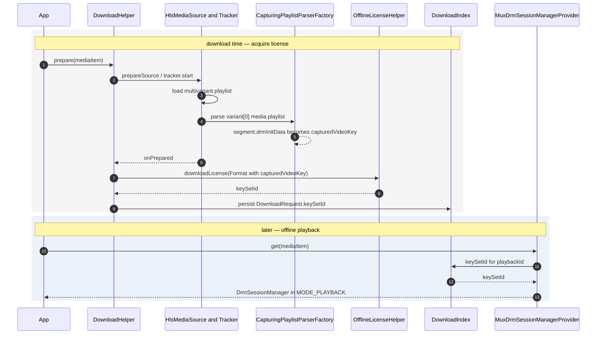
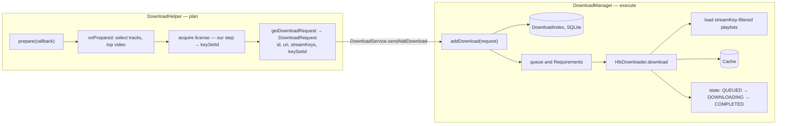
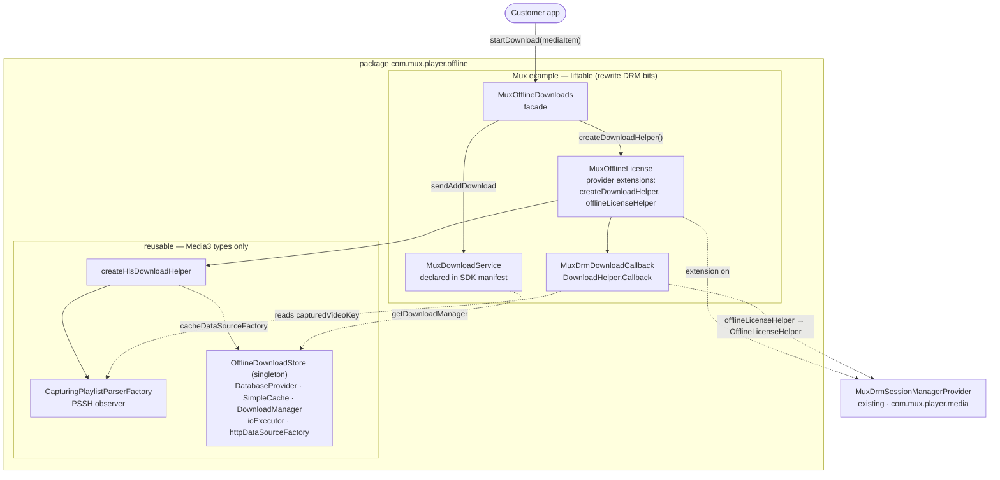

# Offline Widevine DRM for HLS — Design

**Status:** Draft / exploration
**Branch:** `feature/offline-drm`
**Media3 version:** 1.9.2 (line numbers below are 1.9.2). **Behavior verified unchanged through
1.10.1** — see §12.
**Scope of this doc:** Offline *playback* of Widevine-protected HLS. Online playback already
works via `MuxDrmSessionManagerProvider`. This doc covers the **playlist-parser observer**
approach for acquiring a single offline license; other approaches are summarized for contrast.
Encrypted audio (multi-key) is explicitly **deferred** — see §7.

---

## 1. Problem

To play DRM content offline we need an **offline license** (a persisted Widevine
`keySetId`) acquired ahead of time, then replayed at playback via
`DefaultDrmSessionManager.setMode(MODE_PLAYBACK, keySetId)`.

`OfflineLicenseHelper.downloadLicense(format)` requires a `Format` whose `drmInitData` is
non-null — it literally asserts this (`OfflineLicenseHelper.java:231`,
`checkArgument(format.drmInitData != null)`). So the entire problem reduces to:

> **Get the Widevine PSSH / `DrmInitData` for the asset, without playing it.**

For our delivery infra the DRM signaling is always a single `#EXT-X-KEY` tag in each
**media** playlist (no `#EXT-X-SESSION-KEY` in the multivariant playlist, no key rotation).

## 2. Where the PSSH actually lives (verified)

Media3's stock `HlsPlaylistParser` already decodes the Widevine PSSH from `#EXT-X-KEY`.
In `parseDrmSchemeData` (`HlsPlaylistParser.java:1465`):

```java
if (KEYFORMAT_WIDEVINE_PSSH_BINARY.equals(keyFormat)) {        // urn:uuid:edef8ba9-...
  String uriString = parseStringAttr(line, REGEX_URI, variableDefinitions);
  return new SchemeData(
      C.WIDEVINE_UUID, MimeTypes.VIDEO_MP4,
      Base64.decode(uriString.substring(uriString.indexOf(',')), Base64.DEFAULT)); // strips "data:...;base64,"
}
```

The decoded `SchemeData` is attached to **each segment** as `segment.drmInitData` (full PSSH
bytes). It is *not* read out of the downloaded media bytes — it is playlist metadata.

> ⚠️ **Gotcha:** the playlist-level `HlsMediaPlaylist.protectionSchemes` has its PSSH data
> **stripped** — built with `schemeData.copyWithData(null)` (`HlsPlaylistParser.java:1404`).
> Always read the **segment-level** `segment.drmInitData`, never `protectionSchemes`.

## 3. Why the naive `DownloadHelper` recipe fails for HLS

The textbook offline flow is: `DownloadHelper.prepare()` → walk `getTrackGroups()` → find a
`Format` with `drmInitData` → `OfflineLicenseHelper.downloadLicense(format)`. For HLS the
track-group `Format` has **null** `drmInitData`, because HLS prepares "chunkless" by default
(`HlsMediaPeriod.java:655`) and the chunkless format is built by `deriveVideoFormat(...)`
(`HlsMediaPeriod.java`), which constructs a fresh `Format.Builder()` and **never copies
`drmInitData`**. `createTrackGroupArrayWithDrmInfo` only stamps a crypto type
(`HlsSampleStreamWrapper.java:1546`); it does not add init data.

Only the **chunk-loading** prepare path (`setAllowChunklessPreparation(false)`) surfaces it,
because loading a segment fires `output.setDrmInitData(...)` (`HlsMediaChunk.java:600`) →
`deriveFormat` retains it. But that downloads a segment we don't otherwise need.

**Implication:** a custom parser cannot place the PSSH on the chunkless `Format` (the field
is dropped downstream regardless of what the parser emits). So instead of trying to route the
key *onto the Format*, we read it *off the parser output directly*.

## 4. Chosen approach — playlist-parser observer

`HlsMediaSource` runs a `DefaultHlsPlaylistTracker` that, immediately after the multivariant
playlist loads, fetches the **primary** (variant[0]) media playlist
(`DefaultHlsPlaylistTracker.java:318,331-336`) and parses it using the **injected**
`HlsPlaylistParserFactory` (`:802`, the `(multivariantPlaylist, previous)` overload).

We inject a factory that **delegates to the real parser and observes the result**. Because the
tracker already performs this fetch during `DownloadHelper.prepare()` (it needs the media
playlist to build the timeline), we capture the `DrmInitData` with:

- **no extra network call** (we ride the tracker's existing load), and
- **no segment download** (chunkless prep can stay ON — we don't read from the `Format`).

This is **observe-only**: we never mutate or fabricate parsed data, so it can't perturb
playback if the same factory is ever reused in the player.

### 4.1 Observer factory

```kotlin
class CapturingPlaylistParserFactory(
    private val delegate: HlsPlaylistParserFactory = DefaultHlsPlaylistParserFactory(),
    private val onMediaPlaylist: (HlsMediaPlaylist) -> Unit,
) : HlsPlaylistParserFactory {

    // multivariant load — no #EXT-X-KEY here, just delegate
    override fun createPlaylistParser(): ParsingLoadable.Parser<HlsPlaylist> =
        delegate.createPlaylistParser()

    // media-playlist load — #EXT-X-KEY lives here
    override fun createPlaylistParser(
        multivariantPlaylist: HlsMultivariantPlaylist,
        previousMediaPlaylist: HlsMediaPlaylist?,
    ): ParsingLoadable.Parser<HlsPlaylist> {
        val inner = delegate.createPlaylistParser(multivariantPlaylist, previousMediaPlaylist)
        return ParsingLoadable.Parser { uri, input ->
            inner.parse(uri, input).also { if (it is HlsMediaPlaylist) onMediaPlaylist(it) }
        }
    }
}

fun HlsMediaPlaylist.widevineInitData(): DrmInitData? =
    segments.firstNotNullOfOrNull { seg ->
        seg.drmInitData?.takeIf { d -> (0 until d.schemeDataCount).any { d[it].matches(C.WIDEVINE_UUID) } }
    }
```

### 4.2 Wiring (acquisition)

```kotlin
@Volatile var capturedVideoKey: DrmInitData? = null   // single key; parser runs on a loader thread
val parserFactory = CapturingPlaylistParserFactory { mp ->
    mp.widevineInitData()?.let { capturedVideoKey = it }
}

val hlsSource = HlsMediaSource.Factory(dataSourceFactory)
    .setPlaylistParserFactory(parserFactory)
    .setDrmSessionManagerProvider(drmProvider)   // so the DRM track isn't dropped as unselectable
    .createMediaSource(mediaItem)

DownloadHelper.Factory()
    .setRenderersFactory(renderersFactory)
    .create(hlsSource)                            // DownloadHelper.java:248 — inject our MediaSource
    .prepare(callback)                            // by onPrepared, capturedVideoKey is populated
```

### 4.3 License acquisition (reuse Mux callback)

`OfflineLicenseHelper` accepts a `DefaultDrmSessionManager` directly
(`OfflineLicenseHelper.java:186`), so we reuse `MuxDrmCallback` and keep hitting the existing
Mux license endpoint (`InternalUtils.createLicenseUri`).

```kotlin
override fun onPrepared(helper: DownloadHelper, tracksInfoAvailable: Boolean) {
    val drmInitData = capturedVideoKey ?: return  // no DRM in playlist
    val format = Format.Builder()
        .setSampleMimeType(MimeTypes.VIDEO_MP4)
        .setDrmInitData(drmInitData)
        .build()

    val sessionManager = DefaultDrmSessionManager.Builder()
        .setUuidAndExoMediaDrmProvider(C.WIDEVINE_UUID, FrameworkMediaDrm.DEFAULT_PROVIDER)
        .build(MuxDrmCallback(/* playbackId, drmToken, host from mediaItem */))

    val licenseHelper = OfflineLicenseHelper(sessionManager, DrmSessionEventListener.EventDispatcher())
    try {
        val keySetId = licenseHelper.downloadLicense(format)   // MODE_DOWNLOAD internally
        keySetIdStore.put(mediaItem.playbackId, keySetId)
    } finally {
        licenseHelper.release()
        helper.release()
    }
}
```

### 4.4 Playback restore

Thread the stored `keySetId` into `MuxDrmSessionManagerProvider` so its builder calls
`setMode(DefaultDrmSessionManager.MODE_PLAYBACK, keySetId)` when an offline license exists for
the playback ID. With `MODE_PLAYBACK` + a valid `keySetId`, no network license request is made.

## 5. End-to-end flow



## 6. Limitations / caveats

- **Reads the primary (variant[0]) playlist — confirmed correct for Mux.** The tracker
  auto-loads only variant[0] (`DefaultHlsPlaylistTracker.java:398-425`). Mux delivery uses one
  `#EXT-X-KEY` value across all video variants, **and** we download only a single video variant,
  so the captured key is unconditionally the right one. Audio renditions are out of scope (§7).
- **Async, possibly repeated.** The observer fires on a loader thread, and for live it re-fires
  on each refresh. Holder must be thread-safe; capture must be idempotent. `onPrepared` is a
  safe VOD read point.
- **Key never reaches the `Format`.** Chunkless prep still strips it; irrelevant here since we
  read it from the observer.
- **`drmToken` must authorize a persistent/offline license** server-side, or the returned
  license is short-lived. Check `OfflineLicenseHelper.getLicenseDurationRemainingSec(keySetId)`
  (`OfflineLicenseHelper.java:274`) after acquisition; renew via `renewLicense(...)`.
- **`MuxDrmCallback` construction at download time** needs `playbackId` / `drmToken` /
  custom-domain from the `MediaItem` — confirmed available via the existing `MediaItem`
  extension getters, so §9.4 builds the callback directly.

## 7. Deferred: encrypted audio (multi-key)

**Audio is not encrypted today**, so v1 is single-key: one video key, captured per §4. This
section *records but does not design* what changes if audio is encrypted later. With CMAF, each
audio track is a separate `#EXT-X-MEDIA` rendition with its own media playlist and `#EXT-X-KEY`,
so the problem becomes **1 video key + N audio keys**. This would be **a refactor no matter how
v1 is built**, so we are deliberately not optimizing for it now. Sketch for reference:

- **Download all audio renditions.** `DownloadHelper` selects one default audio; to grab every
  rendition, after `onPrepared` add a `SelectionOverride` per audio track group via
  `addTrackSelectionForSingleRenderer(...)` (`DownloadHelper.java:827`). `getDownloadRequest()`
  unions selections into `streamKeys`; `SegmentDownloader` filters to exactly those
  (`SegmentDownloader.java:225`).
- **Acquisition.** The §4 observer can't reach audio playlists — the tracker auto-loads only the
  primary, and `HlsPlaylistParser` is `final` (`:76`) so `HlsDownloader`'s parses can't be
  wrapped. Instead parse each *selected* media playlist
  (`multivariant.copy(streamKeys).mediaPlaylistUrls`) through the **shared
  `CacheDataSource.Factory`** so fetches dedup against the segment download, and acquire one
  license per key.
- **Storage.** A `Map<keyId, keySetId>` keyed by Widevine KID, instead of one `keySetId`.
- **Playback (the real cost).** `DefaultDrmSessionManager` and `DownloadRequest.keySetId` each
  hold exactly one `keySetId`, so multi-key needs a custom `DrmSessionManager` that maps each
  incoming `format.drmInitData`/KID to its stored `keySetId` and opens a restore session per
  key. **Unless** Mux's license server returns a multi-key license (all KIDs in one response) —
  then it collapses back to one `keySetId` and no custom manager is needed (§11).

## 8. Download orchestration (DownloadHelper ↔ DownloadManager)

The two components are deliberately decoupled. **`DownloadHelper` plans** (what to download);
**`DownloadManager` executes** (actually fetch + lifecycle). They hold no reference to each
other — the only contract between them is a serializable **`DownloadRequest`**.

- **`DownloadHelper`** — transient. Prepares the source, lets you select tracks, and emits a
  `DownloadRequest` via `getDownloadRequest(...)`. Downloads nothing; you `release()` it after.
- **`DownloadManager`** — app-scoped singleton, constructed with `(Context,
  WritableDownloadIndex, DownloaderFactory)` (`DownloadManager.java:238`). Accepts
  `DownloadRequest`s via `addDownload(...)` (`:466`), persists them to a SQLite `DownloadIndex`,
  runs a queue (retries, network `Requirements`), creates a `Downloader` per request via
  `downloaderFactory.createDownloader(request)` (`:1015`), and emits `Download` state to listeners.
- **`DownloadService`** (optional) — a foreground `Service` wrapper around the manager for
  background lifecycle + notifications; `DownloadService.sendAddDownload(...)` is the usual way
  the request reaches `downloadManager.addDownload(...)`.



**The two sides must share the same `Cache`.** The manager's `DownloaderFactory` is built with a
`CacheDataSource.Factory` pointing at the cache we read at playback (and the deferred audio path
in §7 would reuse it so playlist fetches dedup).

### 8.1 The `keySetId` seam

`DownloadRequest` carries a `keySetId` field (`DownloadRequest.java:164`), with
`Builder.setKeySetId(...)` (`:83`), `copyWithKeySetId(...)` (`:258`), and `toMediaItem()`
(`:302`) — the built-in place to stash a single offline license.

- **It does not acquire anything.** `getDownloadRequest` only *copies* a keySetId already on the
  `MediaItem`: `setKeySetId(localConfiguration.drmConfiguration.getKeySetId())`
  (`DownloadHelper.java:922`). Acquisition (§4.3) is our step; set it on the `MediaItem` up front
  or `request.copyWithKeySetId(keySetId)` afterward.
- **It's exactly what v1 needs.** One video key → `DownloadRequest.keySetId`; `toMediaItem()`
  round-trips it and `DownloadHelper.createMediaSource(request, dsf, drm)` restores it via
  `MODE_PLAYBACK` (the §4.4 path, essentially built in). A single `byte[]` can't represent
  encrypted-audio multi-key — deferred (§7).

So **v1 has no bespoke license store**: the `keySetId` lives on the `DownloadRequest` in the
`DownloadIndex` the `DownloadManager` already owns. Neither `DownloadHelper` nor
`DownloadManager` ever contacts the license server — they move bytes and state. The license
lifecycle is ours.

## 9. Architecture & API (v1)

All offline code lives in one new sub-package — **`com.mux.player.offline`** — in this module
(no new Gradle module). Reuse in non-Mux Media3 integrations is **by example**: the reusable
plumbing depends only on Media3 types, and the Mux-specific logic is isolated in `Mux*`-named
files a customer lifts and rewrites for their own DRM / license server. The reusable/Mux split
is by **file name + dependency surface**, not a compile-time boundary — the naming *is* the
"lift this part" documentation.

```
com.mux.player.offline/
  ── reusable as-is (Media3 types only) ──
  CapturingPlaylistParserFactory.kt   // PSSH observer (§4.1)
  OfflineDownloadStore.kt             // DatabaseProvider + SimpleCache(NoOpEvictor) + DownloadManager
  OfflineDownloads.kt                 // createHlsDownloadHelper(...)
  ── liftable Mux example (rewrite the DRM bits) ──
  MuxDrmDownloadCallback.kt           // DownloadHelper.Callback (§4.2–4.3 flow)
  MuxOfflineLicense.kt                // provider extensions: offlineLicenseHelper(), createDownloadHelper()
  MuxDownloadService.kt               // concrete DownloadService, declared in the SDK manifest (§9.6)
  MuxOfflineDownloads.kt              // customer-facing facade; prefers MuxDownloadService (§9.7)
```

Component view — how the facade, store, and service wire together (dashed arrows are dependency
/ "uses"; the two inner boxes are the reuse boundary):



### 9.1 Storage — `OfflineDownloadStore`

Process-wide singleton owning the Media3 storage primitives. `SimpleCache` permits one instance
per directory (so this must be a singleton), and it is a **separate cache from the smart-cache**
(`MuxPlayerCache`), using `NoOpCacheEvictor` so downloads are never LRU-evicted.

```kotlin
class OfflineDownloadStore private constructor(
    val databaseProvider: DatabaseProvider,    // StandaloneDatabaseProvider — shared
    val downloadCache: Cache,                   // SimpleCache(dir, NoOpCacheEvictor(), databaseProvider)
    val downloadManager: DownloadManager,       // DownloadManager(ctx, DefaultDownloadIndex(databaseProvider), …)
    val ioExecutor: Executor,                   // opinionated infra — used by §9.5
    val httpDataSourceFactory: DataSource.Factory, // default upstream for playlist/segment fetch
) {
    /** Backs both segment download and offline playback reads. Defaults upstream to httpDataSourceFactory. */
    fun cacheDataSourceFactory(
        upstream: DataSource.Factory = httpDataSourceFactory,
    ): CacheDataSource.Factory

    companion object { fun get(context: Context): OfflineDownloadStore }
}
```

The **license is not stored here** — for single-key v1 it rides `DownloadRequest.keySetId` in
the `DownloadIndex` the `DownloadManager` already owns (§8.1). The store is also where the
**opinionated infra lives** (the IO `Executor` and the default upstream HTTP factory) so §9.5
needn't inject them, and **`MuxDownloadService` (§9.6) draws its `DownloadManager` from here**.

### 9.2 Wired helper — `createHlsDownloadHelper`

Builds a `DownloadHelper` with the observer parser, DRM provider, and download cache wired in.
`capture` is an explicit (defaulted) param so a caller — or §9.5 — can share one instance
between the helper and the callback.

```kotlin
fun createHlsDownloadHelper(
    context: Context,
    mediaItem: MediaItem,
    drmProvider: DrmSessionManagerProvider,         // base type — reusable
    store: OfflineDownloadStore,
    upstream: DataSource.Factory,
    renderersFactory: RenderersFactory = DefaultRenderersFactory(context),
    capture: CapturingPlaylistParserFactory = CapturingPlaylistParserFactory(),
): DownloadHelper =
    DownloadHelper.Factory()
        .setRenderersFactory(renderersFactory)
        .create(
            HlsMediaSource.Factory(store.cacheDataSourceFactory(upstream))
                .setPlaylistParserFactory(capture)
                .setDrmSessionManagerProvider(drmProvider)
                .createMediaSource(mediaItem)
        )
```

### 9.3 Callback — `MuxDrmDownloadCallback`

Implements `DownloadHelper.Callback`. `onPrepared` wraps the track-selection and PSSH-discovery
complexity, acquires the license off the caller thread, and emits a ready-to-enqueue
`DownloadRequest`.

```kotlin
class MuxDrmDownloadCallback(
    private val capture: CapturingPlaylistParserFactory,
    private val drmProvider: MuxDrmSessionManagerProvider,
    private val mediaItem: MediaItem,
    private val ioExecutor: Executor,
    private val onReady: (DownloadRequest) -> Unit,
    private val onError: (IOException) -> Unit,
) : DownloadHelper.Callback {
    override fun onPrepared(helper: DownloadHelper, tracksInfoAvailable: Boolean) {
        // 1. select tracks — top video (+ default audio); audio renditions deferred (§7)
        // 2. videoKey = capture.videoKey  (the #EXT-X-KEY PSSH; §4)
        // 3. ioExecutor: drmProvider.offlineLicenseHelper(mediaItem)?.downloadLicense(format) → keySetId
        // 4. request = helper.getDownloadRequest(data).copyWithKeySetId(keySetId)
        // 5. onReady(request); helper.release()
    }
    override fun onPrepareError(helper: DownloadHelper, e: IOException) = onError(e)
}
```

Acquisition runs on `ioExecutor` because `onPrepared` is delivered on the caller's looper and
`OfflineLicenseHelper.downloadLicense` blocks. DRM content with a null `capture.videoKey` is an
error path (→ `onError`).

### 9.4 License seam — `offlineLicenseHelper` (provider extension)

Extension on `MuxDrmSessionManagerProvider`, reusing its public `drmHttpDataSourceFactory` /
`logger` + the `MediaItem` getters + the public `MuxDrmCallback`. Leaves the online provider
untouched; no real duplication.

```kotlin
internal fun MuxDrmSessionManagerProvider.offlineLicenseHelper(mediaItem: MediaItem): OfflineLicenseHelper? {
    val playbackId = mediaItem.getPlaybackId() ?: return null
    val drmToken = mediaItem.getDrmToken() ?: return null
    val sm = DefaultDrmSessionManager.Builder()
        .setUuidAndExoMediaDrmProvider(C.WIDEVINE_UUID, FrameworkMediaDrm.DEFAULT_PROVIDER)
        .build(MuxDrmCallback(drmHttpDataSourceFactory, mediaItem.getLicenseUrlHost(), drmToken, playbackId, logger))
    return OfflineLicenseHelper(sm, DrmSessionEventListener.EventDispatcher())
}
```

### 9.5 Convenience — `createDownloadHelper` (provider extension)

Mirrors §9.4: a second extension on `MuxDrmSessionManagerProvider` that returns a
fully-configured, already-preparing `DownloadHelper` — it constructs the shared
`CapturingPlaylistParserFactory`, wires it into **both** the helper and `MuxDrmDownloadCallback`,
and kicks off `prepare`. The provider becomes the single Mux entry point for offline, the way
`get()` is for online.

**Opinionated about infra:** the `Executor`, `OfflineDownloadStore`, upstream `DataSource.Factory`,
and `RenderersFactory` are *not* injected — they come from `OfflineDownloadStore.get(context)`
(§9.1) and a `DefaultRenderersFactory(context)`. The signature is just the item + result hooks.

```kotlin
fun MuxDrmSessionManagerProvider.createDownloadHelper(
    context: Context,
    mediaItem: MediaItem,
    onReady: (DownloadRequest) -> Unit,
    onError: (IOException) -> Unit,
): DownloadHelper {
    val store = OfflineDownloadStore.get(context)                        // opinionated
    val capture = CapturingPlaylistParserFactory()                       // one sink…
    val helper = createHlsDownloadHelper(
        context, mediaItem, drmProvider = this, store,
        upstream = store.httpDataSourceFactory,                          // opinionated
        renderersFactory = DefaultRenderersFactory(context),            // opinionated
        capture = capture,                                               // …into the source
    )
    helper.prepare(MuxDrmDownloadCallback(capture, this, mediaItem, store.ioExecutor, onReady, onError)) // …and the callback
    return helper
}
```

The low-level `createHlsDownloadHelper` (§9.2) keeps all four injectable for callers who need to
override; `createDownloadHelper` is the opinionated path.

### 9.6 `MuxDownloadService` — SDK-provided

The SDK ships a concrete `DownloadService` and **declares it in the library manifest**, so it
merges into the consuming app with no app-side registration. Its `DownloadManager` comes from
`OfflineDownloadStore`, so the service and the rest of the SDK act on the same index/cache.

**Notifications are fully opinionated — no customization hook.** The SDK owns the channel, the
progress notification, and the terminal (completed/failed) notifications. The progress
notification is built inline; terminal notifications come from a small internal
`DownloadManager.Listener` the service registers. There is no customer-facing notification API.

```kotlin
class MuxDownloadService : DownloadService(
    FOREGROUND_NOTIFICATION_ID, DEFAULT_FOREGROUND_NOTIFICATION_UPDATE_INTERVAL,
    CHANNEL_ID, R.string.mux_downloads_channel_name, /* descriptionResId = */ 0,
) {
    private val notificationHelper by lazy { DownloadNotificationHelper(this, CHANNEL_ID) }

    override fun getDownloadManager(): DownloadManager =
        OfflineDownloadStore.get(this).downloadManager
            .also { it.addListener(TerminalNotifications(this, notificationHelper)) }
    override fun getScheduler(): Scheduler = PlatformScheduler(this, JOB_ID)   // §11: decided
    override fun getForegroundNotification(downloads: List<Download>, notMet: Int): Notification =
        notificationHelper.buildProgressNotification(
            this, R.drawable.mux_ic_download, /* contentIntent = */ null, /* message = */ null,
            downloads, notMet,   // helper renders progress %, item count
        )
}

/** Opinionated completed/failed notifications. Internal — no customer surface. */
private class TerminalNotifications(
    private val context: Context,
    private val helper: DownloadNotificationHelper,
) : DownloadManager.Listener {
    private var nextId = TERMINAL_NOTIFICATION_BASE_ID
    override fun onDownloadChanged(mgr: DownloadManager, download: Download, e: Exception?) {
        val notification = when (download.state) {
            Download.STATE_COMPLETED ->
                helper.buildDownloadCompletedNotification(context, R.drawable.mux_ic_done, null, null)
            Download.STATE_FAILED ->
                helper.buildDownloadFailedNotification(context, R.drawable.mux_ic_error, null, null)
            else -> return
        }
        NotificationUtil.setNotification(context, nextId++, notification)
    }
}
```

Manifest merge adds the `<service>` plus `FOREGROUND_SERVICE`, `FOREGROUND_SERVICE_DATA_SYNC`,
and `RECEIVE_BOOT_COMPLETED` to **every** consumer of the SDK — accepted as the cost of
one-module + "SDK provides it".

### 9.7 `MuxOfflineDownloads` — customer-facing facade

The one public surface a customer touches. It **prefers `MuxDownloadService`**: `startDownload`
runs the §9.5 path and auto-enqueues the resulting `DownloadRequest` via the service; control
and observation route through the same service / the store's `DownloadManager`. It owns a
default `MuxDrmSessionManagerProvider` so the customer passes only a `MediaItem`.

```kotlin
object MuxOfflineDownloads {
    /** Prepare + acquire license + enqueue to MuxDownloadService. id = playbackId. */
    fun startDownload(context: Context, mediaItem: MediaItem)

    fun remove(context: Context, contentId: String)        // DownloadService.sendRemoveDownload(…, MuxDownloadService::class)
    fun pauseAll(context: Context)                          // sendPauseDownloads
    fun resumeAll(context: Context)                         // sendResumeDownloads
    fun downloadManager(context: Context): DownloadManager  // for addListener / DownloadIndex queries
}
```

```kotlin
// caller's whole world:
MuxOfflineDownloads.startDownload(context, mediaItem)
MuxOfflineDownloads.downloadManager(context).addListener(myListener)   // observe progress/state
```

The mid-level `provider.createDownloadHelper` (§9.5) and the low-level pieces (§9.2–9.3) stay
public for integrations that don't want the service or need custom track selection.

## 10. Alternatives considered

| Approach | Extra network | Notes |
|---|---|---|
| **Observer parser (§4) — chosen** | none | rides the tracker's primary-playlist load; chunkless stays on. Single video key. |
| `setAllowChunklessPreparation(false)` + read `getTrackGroups()` | 1 segment | simpler mental model; downloads a segment just to trigger `setDrmInitData`. |
| Parse the *selected* video playlist via the shared cache | none (cache dedup) | not needed for Mux (single video variant, shared key — §6); kept as the basis of the deferred audio path (§7). |

All read the **same** source: the segment-level `DrmInitData` decoded from `#EXT-X-KEY`.

## 11. Open questions

**v1 (answer these):**
- ~~Do all video variants share one `#EXT-X-KEY`?~~ **Resolved:** yes for Mux, and we download a
  single video variant regardless — the §4 observer reading `variants[0]` is correct (§6).
- ~~Confirm `MuxDrmCallback`'s inputs are reachable from the `MediaItem`.~~ **Resolved:**
  `playbackId` / `drmToken` / custom-domain are available via the existing `MediaItem` extension
  getters; §9.4 builds the callback from them.
- Does the `drmToken` authorize a **persistent/offline** license server-side? (Otherwise the
  license is short-lived — see §6.) **The last genuine v1 unknown.**

**Storage / lifecycle:**
- Cache + index live in `OfflineDownloadStore` (§9.1); license rides `DownloadRequest.keySetId`
  (§8.1). Remaining: renewal (`OfflineLicenseHelper.renewLicense`) and deletion when content is
  removed (evict cache + remove Download).

**Download stack — decided (SDK provides `MuxDownloadService`, §9.6):**
- **Scheduler:** `PlatformScheduler` (JobScheduler; resumes across reboot/network, needs only
  `RECEIVE_BOOT_COMPLETED`).
- **Manifest merge:** accepted — the `<service>` + `FOREGROUND_SERVICE*` / `RECEIVE_BOOT_COMPLETED`
  permissions merge into all SDK consumers.
- **Notifications:** fully opinionated and SDK-owned — channel, progress, and terminal
  (completed/failed) notifications, no customization hook (§9.6).

**Deferred (only if audio gets encrypted, §7):**
- Does Mux's license server return a multi-key license (all KIDs in one response)? Decides
  whether the custom multi-key `DrmSessionManager` is ever needed.

## 12. Media3 1.10.1 verification

Every behavior this design relies on was diffed against 1.10.1 and is **unchanged**:

| Fact | 1.9.2 → 1.10.1 |
|---|---|
| `deriveVideoFormat` doesn't set `drmInitData` (chunkless strips it) | unchanged (only `.setColorInfo(...)` added) |
| `getPlaylistProtectionSchemes` strips PSSH data | identical |
| `createTrackGroupArrayWithDrmInfo` only stamps crypto type | identical |
| `HlsPlaylistParser` is `final`; `HlsDownloader.setManifestParser` takes the concrete type | unchanged |
| `parseDrmSchemeData` Widevine PSSH extraction | logic unchanged (only a `MatcherCache` perf param threaded in) |
| Tracker auto-loads only the primary media playlist | unchanged (now wrapped in `HlsRedundantGroup`, but still `variantRedundantGroups.get(0)`) |
| `DownloadHelper.Factory.create(MediaSource)` injection point; `forMediaItem` deprecated | unchanged |
| `OfflineLicenseHelper` API | identical |

Only HLS changes in 1.10 are unrelated: **redundant/failover stream** support (new
`HlsRedundantGroup`), a parse-perf `MatcherCache`, and HDR `colorInfo` on derived video formats.
The sole consequence for this doc is that `DefaultHlsPlaylistTracker` line numbers shift.
